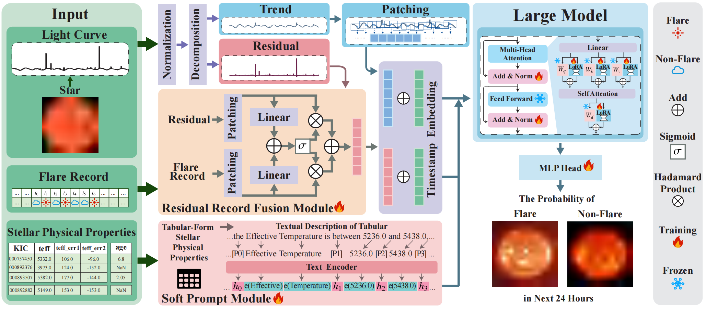

# FLARE: A Framework for Stellar Flare Forecasting Using Stellar Physical Properties and Historical Records

[](https://opensource.org/licenses/MIT)

This is the official repository for the IJCAI-25 paper [FLARE: A Framework for Stellar Flare Forecasting Using Stellar Physical Properties and Historical Records](https://arxiv.org/abs/2502.18218).

## 📖 Introduction

Stellar flare events are critical observational samples for astronomical research; however, recorded flare events remain limited. Stellar flare forecasting can provide additional flare event samples to support research efforts. Despite this potential, no specialized models for stellar flare forecasting have been proposed to date. In this paper, we present extensive experimental evidence demonstrating that both stellar physical properties and historical flare records are valuable inputs for flare forecasting tasks. We then introduce FLARE (Forecasting Light-curve-based Astronomical Records via features Ensemble), the first-of-its-kind large model specifically designed for stellar flare forecasting. FLARE integrates stellar physical properties and historical flare records through a novel Soft Prompt Module and Residual Record Fusion Module. Our experiments on the publicly available Kepler light curve dataset demonstrate that FLARE achieves superior performance compared to other methods across all evaluation metrics. Finally, we validate the forecast capability of our model through a comprehensive case study.

## 🚀 Model Architecture



* **Soft Prompt Module**: Converts tabular-form stellar physical properties and their names into textual descriptions, utilizing P-tuning to distinguish between different stars effectively and facilitate star-specific feature detection.
* **Residual Record Fusion Module**: Decomposes the light curve into trend and residual components, integrating historical flare records with the light curve residuals to enhance model robustness.
* **PLM Fine-tuning**: Employs Parameter-Efficient Fine-Tuning (PEFT) methods like LoRA to freeze the majority of the Pre-trained Large Model (PLM) parameters while allowing it to adapt to cross-modal inputs (physical property texts and light curves).

## 🛠️ Installation

First, clone the repository to your local machine:
```bash
git clone [https://github.com/CASIA-LMC-Lab/FLARE.git](https://github.com/CASIA-LMC-Lab/FLARE.git)
cd FLARE
```

Install the required dependencies:
```bash
pip install -r requirements.txt
```

## 📂 Dataset Preparation

The experiments are conducted on the Kepler light curve dataset, which includes the following files:
* `kepler_flare_id_start_end.npy`
* `kepler_meta_feats3.npy`
* `kids.npy`
* `seqlen_512_horizon_48_stride_50_noPeriod.tar.gz`
* `Kepler_npy.tar.gz`

Please download the dataset from [Google Drive](https://drive.google.com/drive/folders/1vzjyoLW8UjiaUQAj9UegtCU9p_Jf6GWm?usp=drive_link). 

After downloading and extracting the files, update the dataset paths (e.g., `<DATASET_ROOT>` and `<PROJECT_ROOT>`) in `Configs.py` to match your local directory structure.

## 💻 Running & Training

Once the data and environment are ready, you can start the training process by running the following command:

```bash
python LC_classification.py \
    --llm_model BERT \
    --tslm_model BERT \
    --n_runs 3 \
    --flare_process_type FE \
    --id_process_type uniq \
    --ifP_tuning \
    --ifLoRA 
```

**Key Arguments:**
* `--llm_model`: Specifies the large language model used for extracting textual features (e.g., `BERT`, `GPT2`, `Llama`).
* `--tslm_model`: Specifies the time-series processing model engine.
* `--n_runs`: The number of times to repeat the experiment to obtain average performance metrics.
* `--flare_process_type`: Defines how flare features are processed (set to `FE` in this example).
* `--ifP_tuning`: Flag to enable P-tuning for processing soft prompt textual features.
* `--ifLoRA`: Flag to enable Low-Rank Adaptation (LoRA) for efficient fine-tuning of the backbone PLM.

## 📚 Citation

If you find this code or our work helpful in your research, please cite our paper:

```bibtex
@inproceedings{zhu2025flare,
  title={FLARE: A Framework for Stellar Flare Forecasting Using Stellar Physical Properties and Historical Records},
  author={Zhu, Bingke and Wang, Xiaoxiao and Jia, Minghui and Tao, Yihan and Kong, Xiao and Luo, Ali and Chen, Yingying and Tang, Ming and Wang, Jinqiao},
  booktitle={Proceedings of the Thirty-Fourth International Joint Conference on Artificial Intelligence (IJCAI-25)},
  year={2025}
}
```

## 📜 License

This project is licensed under the MIT License. Copyright (c) 2026 CASIA-LMC-Lab. Please refer to the `LICENSE` file in the root directory for full license details.

